<div align="center">

# Glass UI

**A glass look for the web.** One stylesheet, one small script, plain HTML.<br>
No dependencies, no build step.

[Live demo](https://sanprojects.github.io/glass-ui/) · [npm](https://www.npmjs.com/package/glass-ui-css) · MIT

[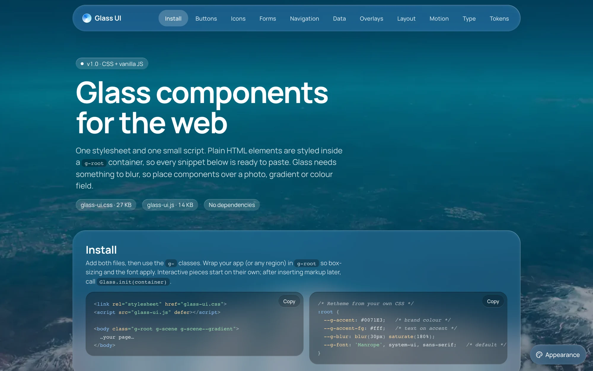](https://sanprojects.github.io/glass-ui/)

</div>

Translucent, blurred panels over a photo, gradient or colour field. Themed through CSS tokens: dark by default, light optional.

## Quick start

```sh
npm i glass-ui-css
```

```html
<link rel="stylesheet" href="glass-ui.min.css">
<link rel="stylesheet" href="glass-icons.min.css">
<link rel="stylesheet" href="glass-ui-light.min.css"> <!-- optional light theme -->
<script src="glass-ui.min.js" defer></script>

<body class="g-root g-scene">
  <button data-variant="primary" data-icon="play">Play</button>
</body>
```

Native elements (`button`, `input`, `table`, `dialog`, `nav`, `article`…) are styled inside `.g-root`. Variants and states are attributes: `data-variant`, `data-size`, `aria-*`. The [live demo](https://sanprojects.github.io/glass-ui/) shows every component with its markup.

## Components

### [Buttons and icons](https://sanprojects.github.io/glass-ui/#buttons)

Primary, glass, light, outline, recessed and danger variants, three sizes, icon-only and block buttons, toggle and removable chips, plus a Lucide icon pack added with `data-icon`.

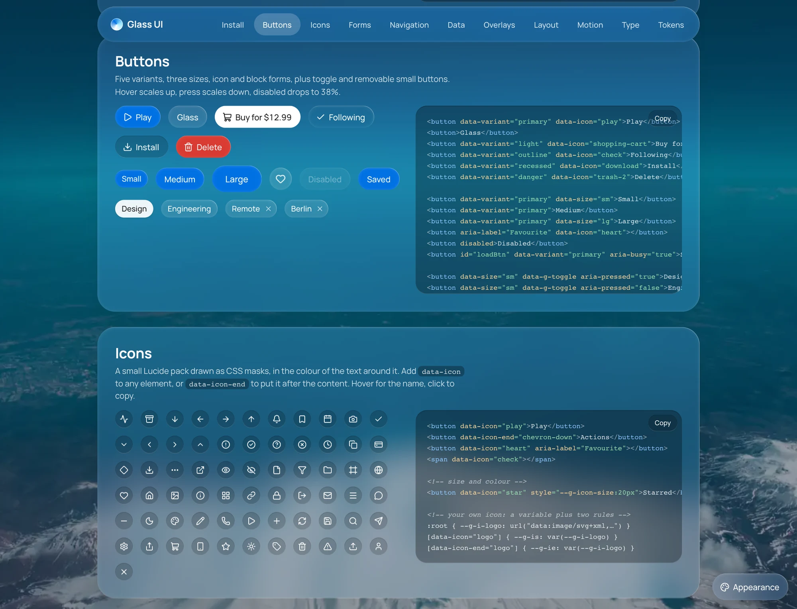

### [Forms](https://sanprojects.github.io/glass-ui/#forms)

Recessed fields with icons and validation states, number stepper, date, time and colour pickers, file drop zone, select with search and multi-select, checkboxes, radios, switches and sliders. All are plain form controls, so they submit and validate natively.

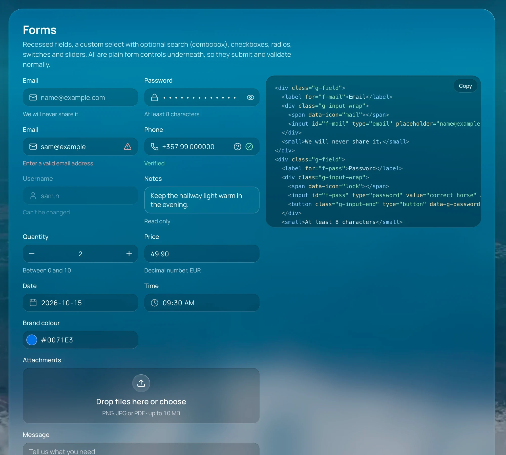

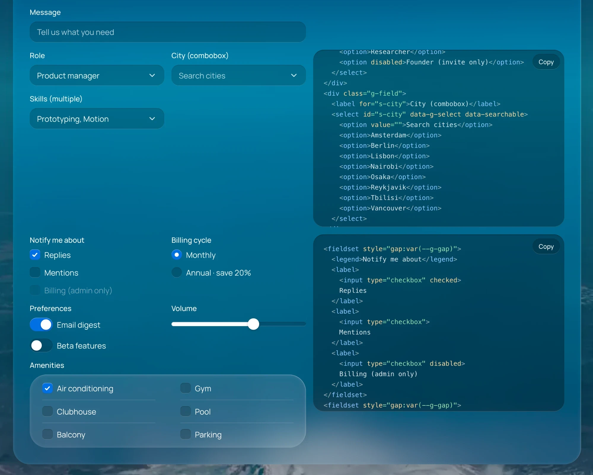

### [Navigation](https://sanprojects.github.io/glass-ui/#navigation)

A floating `<nav>` bar that builds its links from page sections and folds the overflow into a More menu, plus pill and underline tabs with arrow-key support.

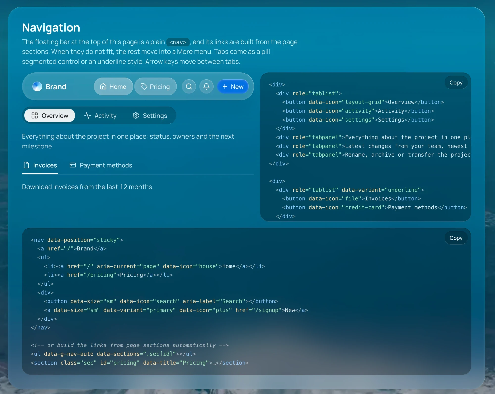

### [Data and content](https://sanprojects.github.io/glass-ui/#data)

Cards (static and fully clickable), badges, progress bars, ring and spinner, a sortable table with row selection and pagination, numbered and bulleted lists.

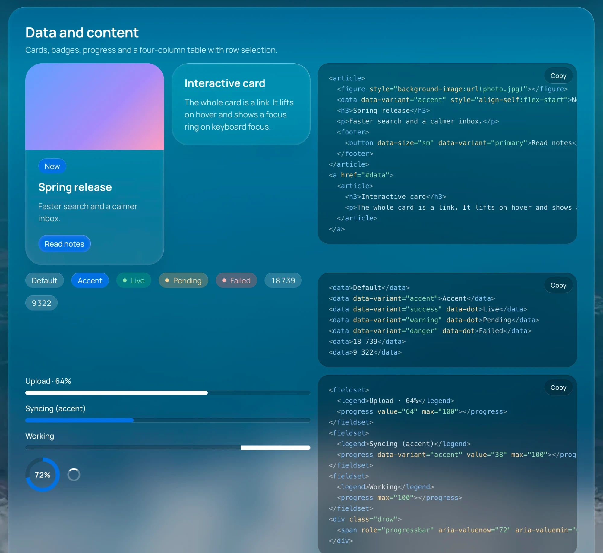

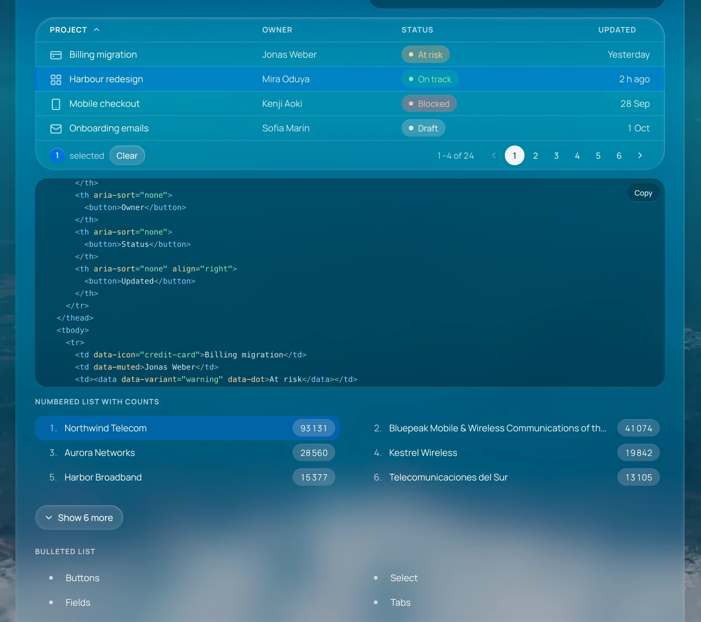

### [Overlays](https://sanprojects.github.io/glass-ui/#overlays)

A dialog on the native `<dialog>` element (focus trap, Esc to close), tooltips, menus and toasts triggered from JavaScript.

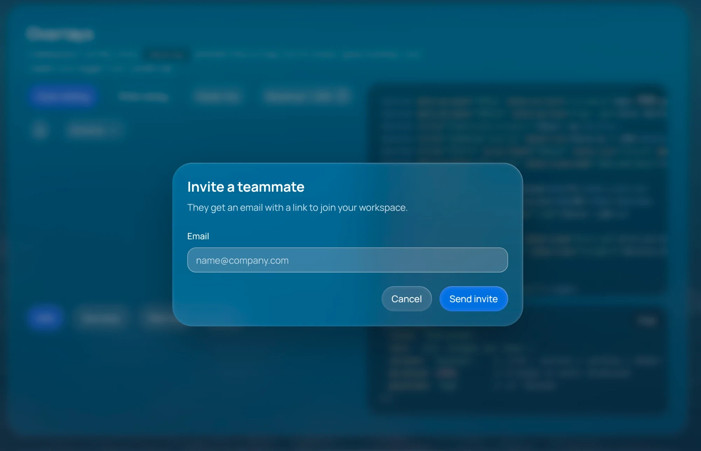

### [Layout](https://sanprojects.github.io/glass-ui/#layout)

An app shell with a tool panel, a workspace and an inspector. The inspector uses the stronger glass; below 900 px the panels stack.

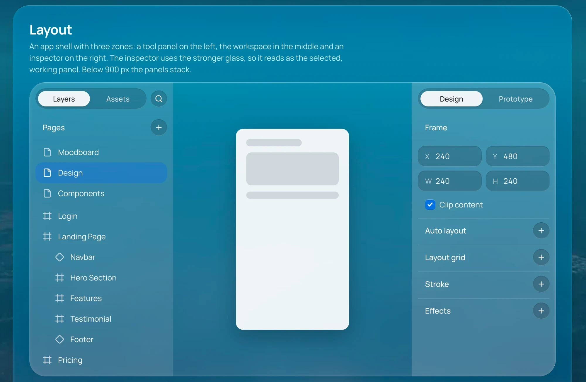

### [Motion](https://sanprojects.github.io/glass-ui/#motion)

Seven effects you add with a single class: appear, shimmer, ripple, pulse, highlight, rotate and zoom. Each plays once; add `g-anim--loop` to repeat, `--g-anim-delay` to stagger a list, or call `Glass.animate(el, 'highlight')` from JavaScript.

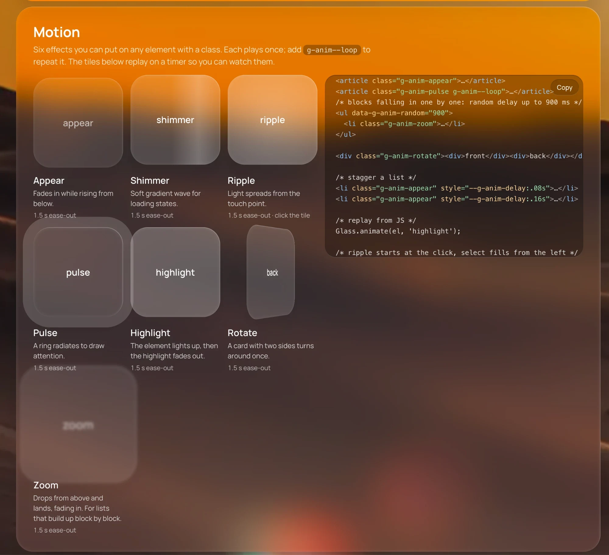

### Appearance

<table>
<tr>
<td width="34%" valign="top">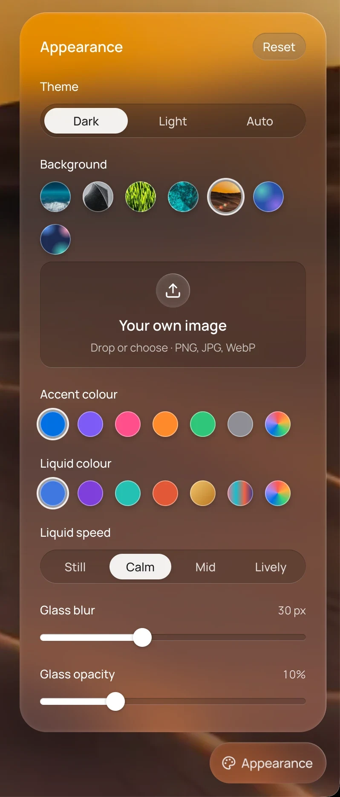</td>
<td valign="top">

An optional settings panel (`glass-appearance.css` / `.js`) that the demo uses to restyle the page live:

- **Theme**: dark, light or auto
- **Background**: a scene from the set, or your own image
- **Accent colour** and **liquid colour**
- **Liquid speed**: still, calm, mid, lively
- **Glass blur** and **glass opacity**
- **Reset** to defaults

</td>
</tr>
</table>

Also in the demo, without screenshots here:

- **[Type](https://sanprojects.github.io/glass-ui/#type)**: styles for `h1`…`small` and `g-prose`, with a font and language switcher.
- **[Tokens](https://sanprojects.github.io/glass-ui/#tokens)**: `--g-accent`, `--g-fill`, `--g-blur`, `--g-radius-*` and more; override on `:root` or any container to retheme a region.

## Files

| File | Purpose |
|---|---|
| `glass-ui.css` / `.js` | the kit |
| `glass-icons.css` | icon pack, used as `data-icon="name"` |
| `glass-ui-light.css` | light theme: `Glass.setTheme('light' \| 'dark' \| 'auto')` |
| `glass-ui-liquid.js` | optional animated background |
| `glass-appearance.css` / `.js` | optional settings panel used by the demo |

Each file also ships as `.min.css` / `.min.js`.

## Good to know

- **Spacing** between neighbours is the `--g-gap` token (14px).
- **Fonts** are not shipped. The kit uses `Manrope` if you load it, otherwise the system font. Set `--g-font` to use your own.
- **Icons** are a subset of [Lucide](https://lucide.dev) (ISC licence, © Lucide Contributors), generated into `glass-icons.css`. Add your own as described in that file.
- **Browsers:** current evergreen browsers.

## Tests

```sh
npm i
npx playwright install chromium
npm test
```

## Licence

MIT
